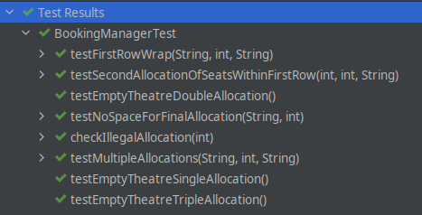

# Cinnamon Cinemas

This repository is an exercise from the [Tech Returners](https://www.techreturners.com) course.

## The Problem

You have a special task from Cinnamon Cinemas to develop a program to allocate seats to customers purchasing tickets for a movie theatre.

The Cinnamon Cinemas Movie Theatre has 15 seats, arranged in 3 rows of 5.
- Rows are assigned a letter from A to C.
- Seats are assigned a number from 1 to 5.

Write a program that allocates seats based on a random integer “number of seats” between 1 and 3.

- Your program should allocate the required number of seats from the available seats starting from seat A1 and filling the auditorium from
left to right, front to back.
- All of the seats are available for sale when the program starts.
- The program should continue to allocate a random number of seats until it finds there are not enough seats left to complete the request.
- Once there are not enough seats available to be allocated then the program can halt.

---
## Solution
### UML

### Notes on the Design

- The Movie Theatre class does not store which Seats have been allocated. Just the number of allocations made and the last allocated seat. Using this data it can determine if it has space for a given allocation. Because of the requirements given in the brief it was not necessary to store which seats have been allocate to meet said requirements when proceeding with a TDD approach.

- Booking Manager expects a correct input `int` value between 1-3 otherwise it throws a `runtimeexception`. It is up to the application using this service to validate an input prior to calling the `allocateSeats` method.

### Unit Tests

---
##  To Run

`mvn compile exec:java`

### Prerequisites

- Java 17
- Maven 3.8.4
